<p align="center">
  <h1>junksweep</h1>
  <p>Find out how much of your disk is <code>node_modules</code> and <code>__pycache__</code>. Then clean it up.</p>
  <a href="https://pypi.org/project/junksweep/"></a>
  <a href="LICENSE"></a>
</p>

<p align="center">
  
</p>

---

## Quick start

```bash
pip install junksweep

# Scan current directory
junksweep

# Scan + prompt to delete
junksweep ~/projects --clean
```

---

## Usage

```bash
# Scan a specific path
junksweep ~/projects

# Don't actually delete
junksweep --dry-run

# Dig deeper
junksweep --depth 5

# Only show big stuff (>= 50MB)
junksweep --min-size 50

# Machine-readable output
junksweep --json
```

---

## What it detects

`node_modules`, `__pycache__`, `.git`, `.next`, `build`, `dist`, `target`, `Pods`, `.gradle`, `vendor/bundle`, `elm-stuff`, `.tox`, `.mypy_cache`, `.ruff_cache` — and about 20 more.

Python 3.8+, no dependencies.

---

## License

MIT
